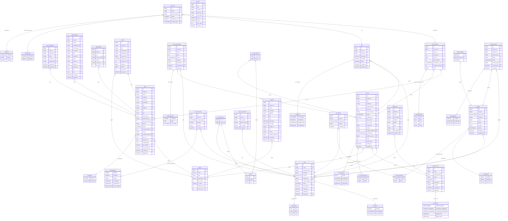

```mermaid
erDiagram

        UserStatus {
            ACTIVE ACTIVE
SUSPENDED SUSPENDED
WITHDRAWN WITHDRAWN
        }
    


        AuthProvider {
            local local
kakao kakao
google google
        }
    


        ConsentType {
            TERMS TERMS
PRIVACY PRIVACY
AGE14 AGE14
LOCATION LOCATION
MARKETING MARKETING
NIGHT_PUSH NIGHT_PUSH
        }
    


        CourseAuthorType {
            EDITOR EDITOR
USER USER
        }
    


        ContentStatus {
            DRAFT DRAFT
IN_REVIEW IN_REVIEW
PUBLISHED PUBLISHED
ARCHIVED ARCHIVED
        }
    


        SpotStatus {
            ACTIVE ACTIVE
INACTIVE INACTIVE
        }
    


        BookmarkTarget {
            COURSE COURSE
SPOT SPOT
        }
    


        TransportType {
            WALK WALK
BUS BUS
TAXI TAXI
CAR CAR
        }
    


        TripStatus {
            UPCOMING UPCOMING
ONGOING ONGOING
COMPLETED COMPLETED
CANCELED CANCELED
        }
    


        VisitStatus {
            PENDING PENDING
DONE DONE
SKIPPED SKIPPED
        }
    


        CheckinType {
            VERIFIED VERIFIED
MANUAL MANUAL
        }
    


        ReviewStatus {
            VISIBLE VISIBLE
HIDDEN HIDDEN
DELETED DELETED
        }
    


        ReportStatus {
            PENDING PENDING
ACCEPTED ACCEPTED
REJECTED REJECTED
        }
    


        AdminRole {
            SUPER_ADMIN SUPER_ADMIN
CONTENT_MANAGER CONTENT_MANAGER
OPERATION_MANAGER OPERATION_MANAGER
MARKETER MARKETER
READ_ONLY READ_ONLY
        }
    


        PurchaseStatus {
            PENDING PENDING
PAID PAID
REFUNDED REFUNDED
        }
    
  "users" {
    BigInt id "🗝️"
    String email "❓"
    String password_hash "❓"
    String nickname 
    AuthProvider provider 
    String provider_id "❓"
    String profile_image_url "❓"
    UserStatus status 
    DateTime last_login_at "❓"
    DateTime created_at 
    DateTime updated_at 
    DateTime deleted_at "❓"
    }
  

  "user_consents" {
    BigInt id "🗝️"
    BigInt user_id 
    ConsentType consent_type 
    Boolean agreed 
    String version 
    DateTime created_at 
    }
  

  "user_interests" {
    BigInt user_id 
    BigInt theme_id 
    }
  

  "user_push_tokens" {
    BigInt id "🗝️"
    BigInt user_id 
    String fcm_token 
    String device_model "❓"
    String os_version "❓"
    DateTime created_at 
    }
  

  "regions" {
    BigInt id "🗝️"
    String name 
    String slug 
    String thumbnail_url "❓"
    Int sort_order 
    Boolean is_active 
    Int visitor_score 
    Int buzz_score 
    }
  

  "themes" {
    BigInt id "🗝️"
    String name 
    String icon "❓"
    }
  

  "spots" {
    BigInt id "🗝️"
    BigInt region_id 
    String name 
    String category 
    String summary "❓"
    String description "❓"
    String tips "❓"
    String address "❓"
    Float lat 
    Float lng 
    Json open_hours "❓"
    String admission_fee "❓"
    Int avg_stay_minutes "❓"
    String phone "❓"
    SpotStatus status 
    Int checkin_radius_m "❓"
    String source 
    String tourapi_content_id "❓"
    Json pet_info "❓"
    Json barrier_free "❓"
    Json related_spots "❓"
    Boolean pet_friendly 
    Boolean has_barrier_free 
    DateTime created_at 
    DateTime updated_at 
    }
  

  "spot_translations" {
    BigInt id "🗝️"
    BigInt spot_id 
    String lang_code 
    String name 
    String summary "❓"
    String description "❓"
    DateTime created_at 
    DateTime updated_at 
    }
  

  "audio_guides" {
    BigInt id "🗝️"
    BigInt spot_id 
    String source 
    String odii_theme_id 
    String odii_story_id 
    String lang_code 
    String title 
    String audio_title "❓"
    String script "❓"
    String audio_url "❓"
    String image_url "❓"
    Int play_time "❓"
    Float lat "❓"
    Float lng "❓"
    DateTime created_at 
    DateTime updated_at 
    }
  

  "spot_images" {
    BigInt id "🗝️"
    BigInt spot_id 
    String url 
    String source_credit "❓"
    String source 
    String source_id "❓"
    Int sort_order 
    }
  

  "videos" {
    BigInt id "🗝️"
    String youtube_id 
    String title 
    String channel_title "❓"
    String thumbnail_url "❓"
    BigInt view_count 
    DateTime published_at "❓"
    Int duration_sec "❓"
    BigInt region_id "❓"
    BigInt spot_id "❓"
    Int sort_order 
    DateTime created_at 
    }
  

  "festivals" {
    BigInt id "🗝️"
    BigInt region_id 
    String name 
    String summary "❓"
    String address "❓"
    Float lat "❓"
    Float lng "❓"
    DateTime start_date 
    DateTime end_date 
    String image_url "❓"
    String tel "❓"
    String source 
    String tourapi_content_id 
    DateTime created_at 
    DateTime updated_at 
    }
  

  "courses" {
    BigInt id "🗝️"
    BigInt region_id 
    String title 
    String summary "❓"
    Int duration_days 
    Int est_cost "❓"
    String cover_image_url "❓"
    ContentStatus status 
    DateTime published_at "❓"
    Int view_count 
    Int save_count 
    BigInt created_by "❓"
    String source 
    String tourapi_content_id "❓"
    CourseAuthorType author_type 
    BigInt author_user_id "❓"
    Int price 
    Int sales_count 
    DateTime created_at 
    DateTime updated_at 
    }
  

  "course_purchases" {
    BigInt id "🗝️"
    BigInt course_id 
    BigInt user_id 
    Int price 
    PurchaseStatus status 
    String provider "❓"
    String payment_id "❓"
    DateTime purchased_at "❓"
    DateTime created_at 
    }
  

  "course_themes" {
    BigInt course_id 
    BigInt theme_id 
    }
  

  "course_items" {
    BigInt id "🗝️"
    BigInt course_id 
    Int day_no 
    Int sort_order 
    BigInt spot_id 
    Int stay_minutes "❓"
    TransportType transport_to_next "❓"
    Int transport_minutes "❓"
    String note "❓"
    }
  

  "bookmarks" {
    BigInt id "🗝️"
    BigInt user_id 
    BookmarkTarget target_type 
    BigInt target_id 
    DateTime created_at 
    }
  

  "trips" {
    BigInt id "🗝️"
    BigInt user_id 
    BigInt course_id 
    DateTime start_date 
    DateTime end_date 
    TripStatus status 
    DateTime created_at 
    DateTime updated_at 
    }
  

  "trip_visits" {
    BigInt id "🗝️"
    BigInt trip_id 
    BigInt course_item_id 
    VisitStatus status 
    DateTime checked_in_at "❓"
    CheckinType checkin_type "❓"
    }
  

  "reviews" {
    BigInt id "🗝️"
    BigInt user_id 
    BookmarkTarget target_type 
    BigInt target_id 
    BigInt trip_id "❓"
    Int rating 
    String content 
    ReviewStatus status 
    DateTime created_at 
    DateTime updated_at 
    }
  

  "review_images" {
    BigInt id "🗝️"
    BigInt review_id 
    String url 
    }
  

  "review_reports" {
    BigInt id "🗝️"
    BigInt review_id 
    BigInt reporter_id 
    String reason_code 
    String detail "❓"
    ReportStatus status 
    BigInt processed_by "❓"
    DateTime processed_at "❓"
    DateTime created_at 
    }
  

  "banners" {
    BigInt id "🗝️"
    String title 
    String image_url 
    String link_type 
    String link_target "❓"
    DateTime start_at 
    DateTime end_at 
    Int sort_order 
    Boolean is_active 
    }
  

  "admin_users" {
    BigInt id "🗝️"
    String email 
    String password_hash 
    String name 
    AdminRole role 
    String totp_secret "❓"
    Boolean is_active 
    DateTime last_login_at "❓"
    DateTime created_at 
    }
  

  "audit_logs" {
    BigInt id "🗝️"
    BigInt admin_id 
    String action 
    String entity_type 
    String entity_id "❓"
    Json before "❓"
    Json after "❓"
    String ip "❓"
    String user_agent "❓"
    DateTime created_at 
    }
  
    "users" |o--|| "AuthProvider" : "enum:provider"
    "users" |o--|| "UserStatus" : "enum:status"
    "user_consents" |o--|| "ConsentType" : "enum:consent_type"
    "user_consents" }o--|| users : "user"
    "user_interests" }o--|| users : "user"
    "user_interests" }o--|| themes : "theme"
    "user_push_tokens" }o--|| users : "user"
    "spots" |o--|| "SpotStatus" : "enum:status"
    "spots" }o--|| regions : "region"
    "spot_translations" }o--|| spots : "spot"
    "audio_guides" }o--|| spots : "spot"
    "spot_images" }o--|| spots : "spot"
    "videos" }o--|o regions : "region"
    "videos" }o--|o spots : "spot"
    "festivals" }o--|| regions : "region"
    "courses" |o--|| "ContentStatus" : "enum:status"
    "courses" |o--|| "CourseAuthorType" : "enum:author_type"
    "courses" }o--|| regions : "region"
    "courses" }o--|o admin_users : "creator"
    "courses" }o--|o users : "author"
    "course_purchases" |o--|| "PurchaseStatus" : "enum:status"
    "course_purchases" }o--|| courses : "course"
    "course_purchases" }o--|| users : "user"
    "course_themes" }o--|| courses : "course"
    "course_themes" }o--|| themes : "theme"
    "course_items" |o--|o "TransportType" : "enum:transport_to_next"
    "course_items" }o--|| courses : "course"
    "course_items" }o--|| spots : "spot"
    "bookmarks" |o--|| "BookmarkTarget" : "enum:target_type"
    "bookmarks" }o--|| users : "user"
    "trips" |o--|| "TripStatus" : "enum:status"
    "trips" }o--|| users : "user"
    "trips" }o--|| courses : "course"
    "trip_visits" |o--|| "VisitStatus" : "enum:status"
    "trip_visits" |o--|o "CheckinType" : "enum:checkin_type"
    "trip_visits" }o--|| trips : "trip"
    "trip_visits" }o--|| course_items : "courseItem"
    "reviews" |o--|| "BookmarkTarget" : "enum:target_type"
    "reviews" |o--|| "ReviewStatus" : "enum:status"
    "reviews" }o--|| users : "user"
    "review_images" }o--|| reviews : "review"
    "review_reports" |o--|| "ReportStatus" : "enum:status"
    "review_reports" }o--|| reviews : "review"
    "review_reports" }o--|| users : "reporter"
    "admin_users" |o--|| "AdminRole" : "enum:role"
    "audit_logs" }o--|| admin_users : "admin"
```
